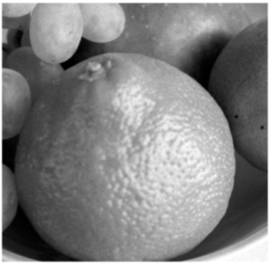
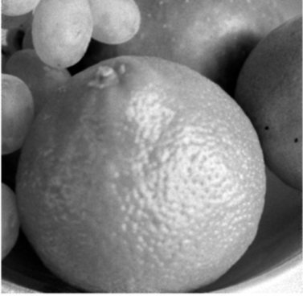
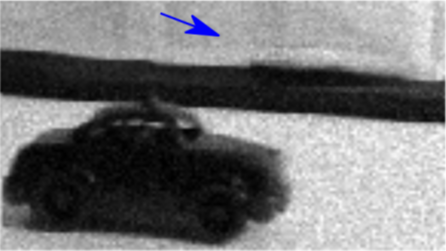

# Motion Adaptive Deblurring with Single-Photon Cameras

**Authors:** Trevor Seets¹, Atul Ingle¹, Martin Laurenzis², Andreas Velten¹  
**Affiliations:** ¹University of Wisconsin-Madison, ²French-German Research Institute of Saint-Louis  
**Publication:** WACV 2021

**[Paper PDF](https://openaccess.thecvf.com/content/WACV2021/papers/Seets_Motion_Adaptive_Deblurring_With_Single-Photon_Cameras_WACV_2021_paper.pdf) | [Supp](https://openaccess.thecvf.com/content/WACV2021/supplemental/Seets_Motion_Adaptive_Deblurring_WACV_2021_supplemental.zip) | [Video](https://www.youtube.com/watch?v=Hd1pGvt612w)**

---

## Abstract

Single-photon avalanche diodes (SPADs) are a rapidly developing image sensing technology with extreme lowlight sensitivity and picosecond timing resolution. These unique capabilities have enabled SPADs to be used in applications like LiDAR, non-line-of-sight imaging and fluorescence microscopy that require imaging in photon-starved scenarios. In this work we harness these capabilities for dealing with motion blur in a passive imaging setting in low illumination conditions. Our key insight is that the data captured by a SPAD array camera can be represented as a 3Dspatio-temporal tensor of photon detection events which can be integrated along arbitrary spatio-temporal trajectories with dynamically varying integration windows, depending on scene motion. We propose an algorithm that estimates pixel motion from photon timestamp data and dynamically adapts the integration windows to minimize motion blur. Our simulation results show the applicability of this algorithm to a variety of motion profiles including translation, rotation and local object motion. We also demonstrate the real-world feasibility of our method on data captured using a 32 ×32 SPAD camera.

---

## Our Pipeline

Our method consists of four key steps, as illustrated in the pipeline below:

<p align="center">
  
  <br>
  <em>Overview of our adaptive motion deblurring method.</em>
</p>

1.  **Per-pixel Changepoint Detection**: We first analyze the stream of photon timestamps for each pixel independently. Using a statistical changepoint detection algorithm, we identify the exact moments when the photon flux (i.e., brightness) changes significantly.

2.  **Changepoint Video (CPV) Generation**: Based on these detected changepoints, we convert the noisy raw photon data into a piecewise-constant "Changepoint Video" (CPV). This video has an adaptive frame rate and preserves the sharp edges of moving objects.

3.  **Motion Estimation**: We then analyze the consecutive frames of the CPV to estimate global or local motion trajectories, such as translation and rotation.

4.  **Integrate Photons over Motion Trajectories**: Finally, using the estimated motion, we integrate the original photon timestamp data along these trajectories in the spatio-temporal domain. This process effectively accumulates signal while canceling out motion blur, producing a clean, high signal-to-noise ratio image.

---

## Results

### 1. Simulation Results

**Global Rotation:** We simulated a rotating orange to test our algorithm's performance on global rotational motion. Compared to a long exposure (blurry) and a short exposure (noisy), our method achieves a superior balance of detail preservation and high signal-to-noise ratio.

| Ground Truth | Long Exposure | Short Exposure | **Proposed (Ours)** |
|:---:|:---:|:---:|:---:|
|  |  |  |  |

**Multiple Moving Objects:** This scene contains a fast-moving, high-contrast dark car and a slow-moving, low-contrast light car. Our method, by dynamically adapting its integration window, successfully reconstructs both cars with high fidelity, a task where prior methods struggle.

<!-- | Ground Truth | Gyöngy et al. 2018 | **Proposed (Ours)** |
|:---:|:---:|:---:|
|  |  |  | -->

<!-- | Ground Truth | Short Exposure | Long Exposure |
|:---:|:---:|:---:|
|  |  |  |
| Gyöngy et al. 2018 | CPV Frame (t=0.1s) | **Proposed (Ours)** |
|  |  | | -->

| Ground Truth | Short Exposure | Long Exposure |
|:---:|:---:|:---:|
|  |  |  |
| **Gyöngy et al. 2018** | **CPV Frame (t=0.1s)** | **Proposed (Ours)** |
|  |  |  |


### 2. Real-World Experiments

We validated our approach with real-world experiments using a commercial 32x32 SPAD camera.

**Rotating "Fan" Scene And Translating "Checkerboard" Scene:**
 

<!-- | Raw Data | Long Exposure | **Proposed (Ours)** |
|:---:|:---:|:---:|
|  |  |  |


**Translating "Checkerboard" Scene:**
| Raw Data | Long Exposure | **Proposed (Ours)** |
|:---:|:---:|:---:|
|  |  |  | -->

---

## Video Results

The following videos demonstrate our deblurring results on real-world dynamic scenes captured with the SPAD camera.

### 1. Raw Photon Frame (Reference)

<p align="center">
  <video src="./assets/videos/fan_photon_frames.mp4" width="70%" controls></video><br>
  <em>Raw photon timestamp video of the fan scene captured using a 32×32 SPAD camera (50,000 photon frames per second).</em>
</p>

---

### 2. Method Comparison Across Scenes

The following comparisons illustrate the trade-offs between exposure length and motion sharpness.  
Our proposed motion-adaptive integration achieves **sharper edges and higher SNR** across all tested scenes.

| Short Exposure | Long Exposure | **Proposed (Ours)** |
|:---:|:---:|:---:|
| <video src="./assets/videos/fan_short.mp4" width="85%" controls ></video><br><em>Fan (Short)</em> | <video src="./assets/videos/fan_long.mp4" width="85%" controls style="margin-right:21px;"></video><br><em>Fan (Long)</em> | <video src="./assets/videos/fan_ours.mp4" width="100%" controls></video><br><em>Fan (Ours)</em> |
| <video src="./assets/videos/checkerboard_short.mp4" width="85%" controls></video><br><em>Checkerboard (Short)</em> | <video src="./assets/videos/checkerboard_long.mp4" width="85%" controls style="margin-right:21px;"></video><br><em>Checkerboard (Long)</em> | <video src="./assets/videos/checkerboard_ours.mp4" width="100%" controls></video><br><em>Checkerboard (Ours)</em> |
| <video src="./assets/videos/orange_short.mp4" width="84%" controls></video><br><em>Orange (Short)</em> | <video src="./assets/videos/orange_long.mp4" width="84%" controls ></video><br><em>Orange (Long)</em> | <video src="./assets/videos/orange_ours.mp4" width="100%" controls></video><br><em>Orange (Ours)</em> |

<p align="center">
  <em>Comparison of motion deblurring results across three methods on different SPAD imaging scenes. The proposed approach achieves sharp reconstructions without sacrificing low-light performance.</em>
</p>


---

<a name="citation"></a>
## Citation
If you find our work useful in your research, please consider citing our paper:
```bibtex
@inproceedings{seets2021motion,
  title={Motion Adaptive Deblurring with Single-Photon Cameras},
  author={Seets, Trevor and Ingle, Atul and Laurenzis, Martin and Velten, Andreas},
  booktitle={Proceedings of the IEEE/CVF Winter Conference on Applications of Computer Vision (WACV)},
  pages={1945--1954},
  year={2021}
}
